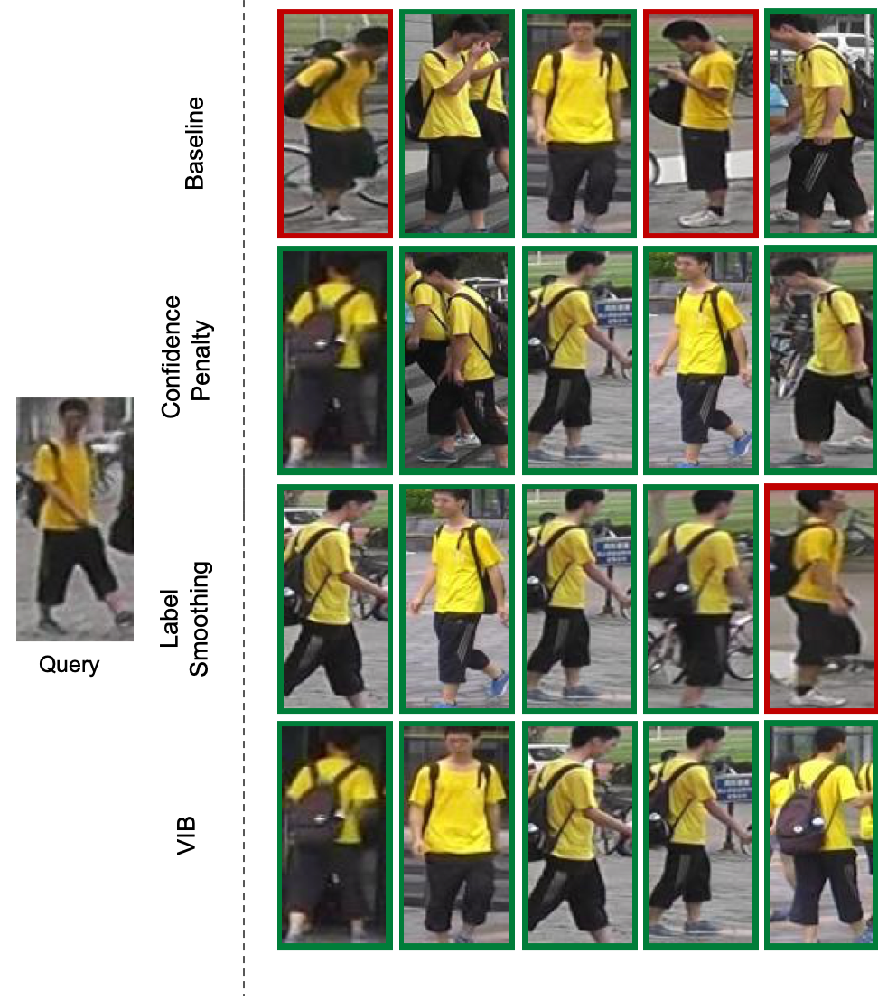

# Deep Visual Re-Identification with Confidence


> Transportation systems often rely on understanding the flow of vehicles or
> pedestrian. From traffic monitoring at the city scale, to commuters in train
> terminals, recent progress in sensing technology make it possible to use
> cameras to better understand the demand, *i.e.*, better track moving
> agents (*e.g.*, vehicles and pedestrians). Whether the cameras are
> mounted on drones, vehicles, or fixed in the built environments, they
> inevitably remain scatter. We need to develop the technology to re-identify
> the same agents across images captured from non-overlapping field-of-views,
> referred to as the visual re-identification task. State-of-the-art methods
> learn a neural network based representation trained with the cross-entropy
> loss function. We argue that such loss function is not suited for the visual
> re-identification task hence propose to model confidence in the representation
> learning framework. We show the impact of our confidence-based learning
> framework with three methods: label smoothing, confidence penalty, and deep
> variational information bottleneck. They all show a boost in performance
> validating our claim. Our contribution is generic to any agent of interest,
> *i.e.*, vehicles or pedestrians, and outperform highly specialized
> state-of-the-art methods across 6 datasets. The source code and models are
> shared towards an open science mission.

[Paper](https://authors.elsevier.com/sd/article/S0968-090X(21)00092-9)

# Demo



## Get started
1. `cd` to the folder where you want to download this repo.
2. Clone ths repo.
3. Install dependencies by `pip install -r requirements.txt`.
4. To accelerate evaluation (10x faster), you can use cython-based evaluation code (developed by [luzai](https://github.com/luzai)). First `cd` to `eval_lib`, then do `make` or `python setup.py build_ext -i`. After that, run `python test_cython_eval.py` to test if the package is successfully installed.

### Data structure

    Dataset         
    ├── market1501
        ├── bounding_box_test
        ├── bounding_box_train
        ├── gt_bbox
        ├── gt_query
        ├── query
    ├── dukemtmc-reid
        ├── DukeMTMC-reID
            ├── bounding_box_test
            ├── bounding_box_train
            ├── query
    ├── msmt17
        ├── MSMT17_V1
            ├── train
            ├── test
            ├── list_gallery.txt
            ├── list_query.txt
            ├── list_train.txt
            ├── list_val.txt
    ├── vehicle
        ├── veri-776
           ├── VeRi_with_plate
        ├── veri-wild
           ├── Wild
           ├── train_test_split

# Train

To train using normal cross-entropy:

```sh
python train_imgreid_xent_regularizer.py -a resnet50 -d market1501 --optim amsgrad --max-epoch 300 --train-batch 32 --learning-rate 0.0003 --stepsize 20 40 --height 256 --width 128 --fixbase-epoch=6 --fixbase-lr=0.0003 --save-dir /outputs/resnet50_market1501_amsgrad_e300_b32_lr0.0003_crossEntropy --test-batch 100 --gpu-devices 0 --root Dataset/ --scheduler --eval-step 10
```

To train using label smoothing:

```sh
python train_imgreid_xent_regularizer.py -a resnet50 -d market1501 --optim amsgrad --max-epoch 300 --train-batch 32 --learning-rate 0.0003 --stepsize 20 40 --label-smooth --height 256 --width 128 --fixbase-epoch=6 --fixbase-lr=0.0003 --save-dir /outputs/resnet50_market1501_amsgrad_e300_b32_lr0.0003_labelSmoothing --test-batch 100 --gpu-devices 0 --root Dataset/ --scheduler --eval-step 10
```
To train using confidence penalty:

```sh
python train_imgreid_xent_regularizer.py -a resnet50 -d market1501 --optim amsgrad --max-epoch 300 --train-batch 32 --learning-rate 0.0003 --stepsize 20 40 --confidence-penalty --confidence-beta 0.085 --height 256 --width 128 --fixbase-epoch=6 --fixbase-lr=0.0003 --save-dir /outputs/resnet50_market1501_amsgrad_e300_b32_lr0.0003_confidencePenalty --test-batch 100 --gpu-devices 0 --root Dataset/ --scheduler --eval-step 10
```
To train using VIB:

```sh
python train_imgreid_xent_vib.py -a resnet50_vib -d market1501 --optim amsgrad --max-epoch 300 --train-batch 32 --learning-rate 0.0003 --stepsize 20 40 --beta 0.01 --height 256 --width 128 --fixbase-epoch=6 --fixbase-lr=0.0003 --save-dir outputs/resnet50_market1501_amsgrad_e300_b32_lr0.0003_vib --test-batch 100 --gpu-devices 0 --root Dataset/ --scheduler --eval-step 10
```

# Evaluation

To evaluate your model that is trained using Cross-Entropy/Label Smoothing/Confidence Penalty:

```sh
python train_imgreid_xent_vib.py -a resnet50 -d market1501 --height 256 --width 128 --load-weights outputs/resnet50_market1501_amsgrad_e300_b32_lr0.0003_confidencePenalty/best_model.pth.tar --test-batch 100 --gpu-devices 0 --root Dataset/ --evaluate
```

To evaluate your model that is trained using VIB:
```sh
python train_imgreid_xent_vib.py -a resnet50_vib -d market1501 --height 256 --width 128 --load-weights outputs/resnet50_market1501_amsgrad_e300_b32_lr0.0003_vib/best_model.pth.tar --test-batch 100 --gpu-devices 0 --root Dataset/ --evaluate
```
